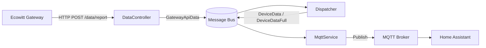
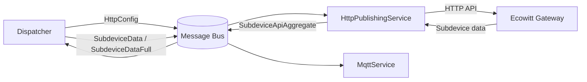
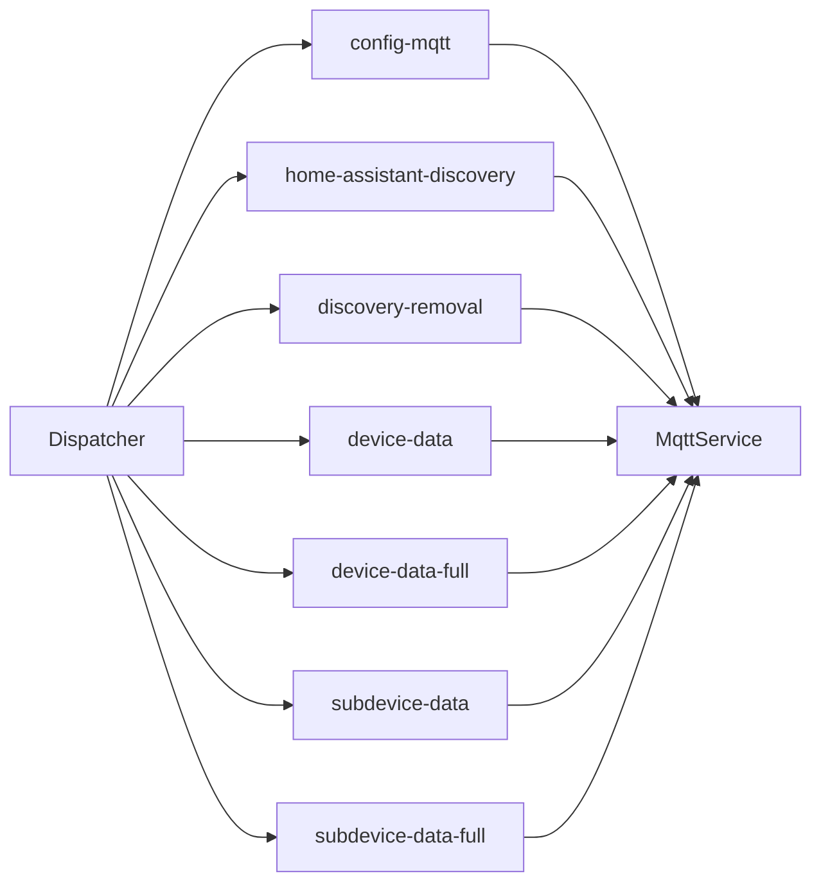
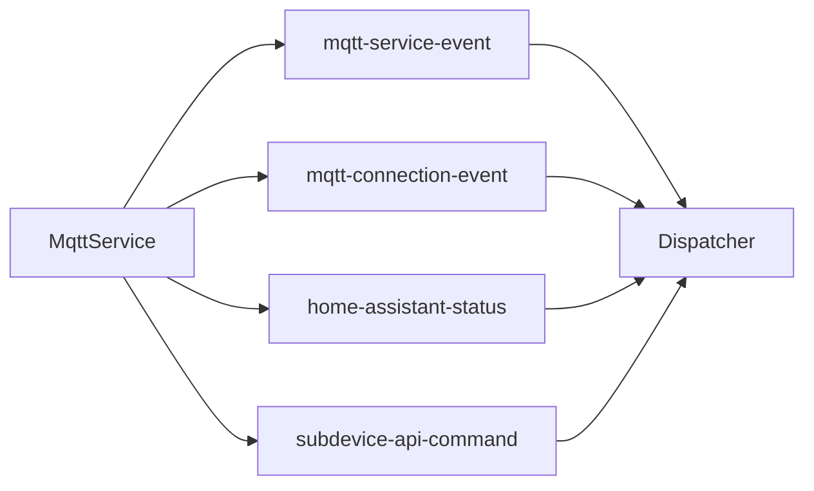
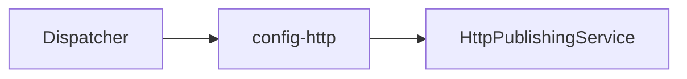
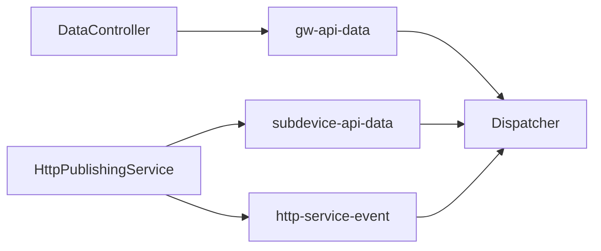
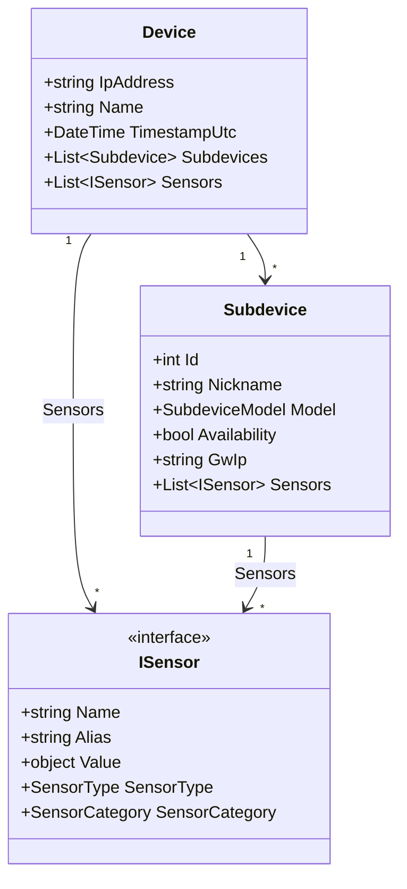

# Architecture

Ecowitt Controller runs three background services connected by an in-memory message bus (SlimMessageBus). Weather data arrives via HTTP from Ecowitt gateways, subdevice state is polled from gateway APIs, and everything is published over MQTT with optional Home Assistant discovery.

## Data Flow

## Subdevice Polling

## Message Bus Topology

### Dispatcher to MqttService

Configuration, device data, and discovery messages.

### MqttService to Dispatcher

Service lifecycle events, MQTT connection state, HA status, and subdevice commands received via MQTT.

### Dispatcher to HttpPublishingService

Subdevice polling configuration.

### HttpPublishingService and DataController to Dispatcher

Inbound weather data and polled subdevice data.

## Service Responsibilities

### DataController
ASP.NET endpoint at `POST /data/report`. Receives form-encoded weather data from Ecowitt gateways and publishes `GatewayApiData` onto the bus.

### Dispatcher
Central orchestrator. Consumes messages from both HTTP and MQTT services, manages the `DeviceStore` (thread-safe in-memory state), performs change detection via `DeNoiserHelper`, and emits data and discovery messages. Split across partial classes for HTTP consumers, MQTT consumers, and orchestration logic.

### MqttService
Connects to the MQTT broker, publishes sensor data and Home Assistant discovery payloads, subscribes to HA status topic for re-emission on HA restart, and handles subdevice commands from HA switches. Split across partial classes for consumer, publisher, discovery, and events.

### HttpPublishingService
Polls Ecowitt gateway HTTP APIs (`get_iot_device_list`, `parse_quick_cmd_iot`) for subdevice data on a configurable interval. Also sends subdevice commands (start/stop) back to gateways.

## Domain Model

