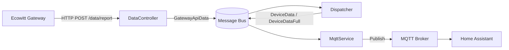
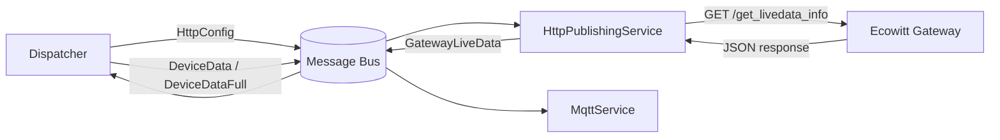
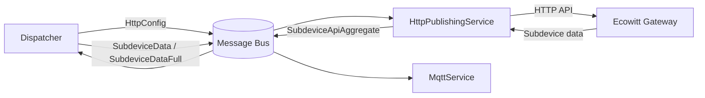
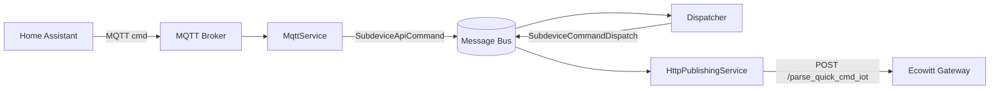
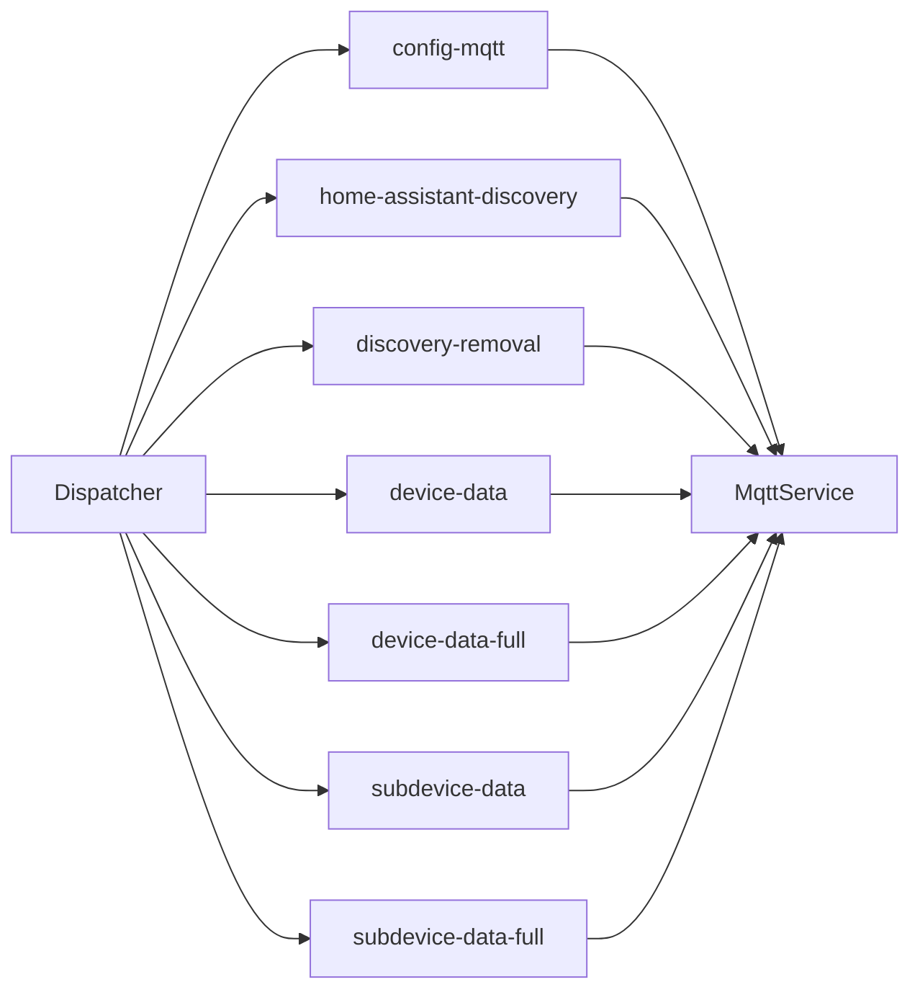
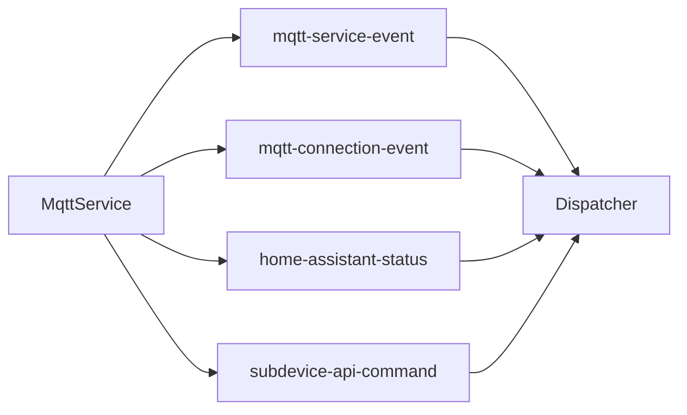
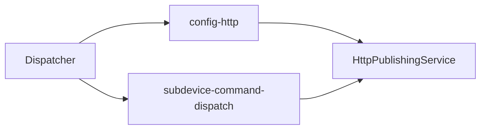
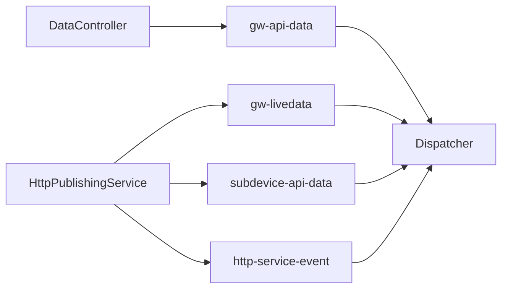
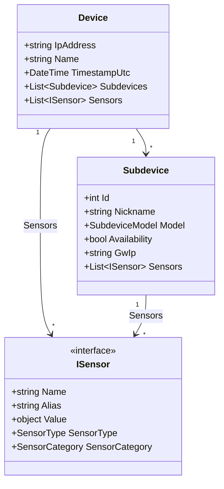

# Architecture

Ecowitt Controller runs three background services connected by an in-memory message bus (SlimMessageBus). Weather data arrives via HTTP from Ecowitt gateways (either push or poll, configurable per gateway), subdevice state and commands flow through a gateway HTTP API, and everything is published over MQTT with optional Home Assistant discovery.

## Ingestion Modes

Each gateway is configured (via `ecowitt.gateways[].ingestMode`) as either:

- **`Push`** (default) — gateway initiates uploads via `POST /data/report`. Imperial source units; controller converts to `controller.unit`.
- **`Poll`** — controller polls `get_livedata_info` on `ecowitt.liveDataInterval`. Whatever unit the gateway is configured to display in WSView is the unit that lands in HA (passthrough). Only available on GW1200/GW2000/GW3000.

Both paths terminate at `Dispatcher.OnHandle(GatewayApiData)` and `Dispatcher.OnHandle(GatewayLiveData)` respectively, both produce `Device` objects via their own mapper extension, both feed the same `DeviceStore` and downstream MQTT publish pipeline. The two paths coexist — a deployment can have one gateway in Push mode and another in Poll mode.

## Data Flow

### Push ingestion

### Poll ingestion (livedata)

## Subdevice Polling

## Subdevice Command Dispatch

Commands originate from MQTT (HA switches or direct JSON) and flow back to the gateway over the same `HttpPublishingService` HTTP path. Dispatcher resolves the gateway and publishes `SubdeviceCommandDispatch` rather than calling the HTTP service directly — every cross-service interaction in the system goes through the bus.

## Per-gateway Concurrency

All HTTP traffic to a given gateway — subdevice polling, livedata polling (when in Poll mode), and command dispatch — runs through `HttpPublishingService` and serializes through a `ConcurrentDictionary<string, SemaphoreSlim>` keyed by gateway IP. At most one HTTP request per gateway is in flight at any moment. Different gateways still get full parallelism. A separate 350ms `Task.Delay` between subdevice payload calls handles rate-limiting (a separate contract from concurrency).

## Message Bus Topology

### Dispatcher to MqttService

Configuration, device data, and discovery messages.

### MqttService to Dispatcher

Service lifecycle events, MQTT connection state, HA status, and subdevice commands received via MQTT.

### Dispatcher to HttpPublishingService

HTTP polling configuration (subdevice + livedata hosts and intervals) and subdevice command dispatch.

### HttpPublishingService and DataController to Dispatcher

Inbound weather data (push), polled livedata, polled subdevice data, and service lifecycle.

## Service Responsibilities

### DataController
ASP.NET endpoint at `POST /data/report`. Receives form-encoded weather data from Push-mode gateways and publishes `GatewayApiData` onto the bus. For Poll-mode gateways, the request is accepted (200 OK) but the payload is dropped by Dispatcher at the bus boundary — no DataController logic needs to know about IngestMode.

### Dispatcher
Central orchestrator. Consumes messages from both HTTP and MQTT services, manages the `DeviceStore` (thread-safe in-memory state), performs change detection via `DeNoiserHelper`, and emits data and discovery messages. For Poll-mode gateways it also drops any incoming `GatewayApiData` push payload (the IngestMode filter lives here, not in DataController). Split across partial classes for HTTP consumers, MQTT consumers, and orchestration logic.

### MqttService
Connects to the MQTT broker, publishes sensor data and Home Assistant discovery payloads, subscribes to HA status topic for re-emission on HA restart, and forwards subdevice commands from HA switches onto the bus as `SubdeviceApiCommand` messages. Split across partial classes for consumer, publisher, discovery, and events.

### HttpPublishingService
Owns all outbound HTTP traffic to gateways. Runs two `PeriodicTimer` loops in parallel — one for subdevice polling (`get_iot_device_list` + `parse_quick_cmd_iot`), one for livedata polling (`get_livedata_info`) on Poll-mode gateways — plus a `SubdeviceCommandDispatch` bus consumer that issues start/stop commands. All three call sites acquire a per-gateway `SemaphoreSlim` to serialize requests to the same device.

## Domain Model

